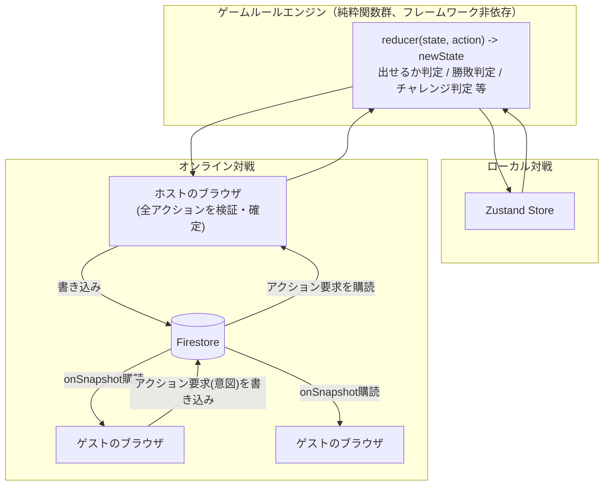
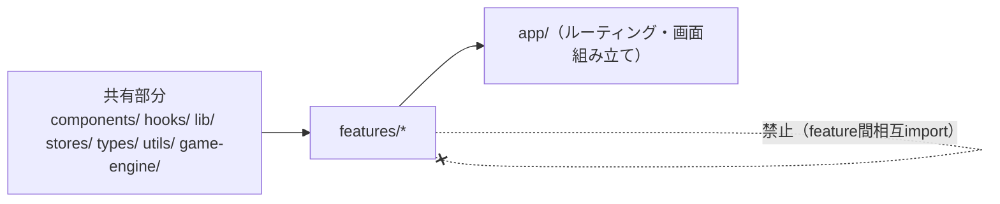

# UNO by Next.js 設計書

- ステータス: Draft v0.1
- 最終更新日: 2026-08-15

## 1. 概要

Next.js（静的サイトエクスポート）で動作するUNOアプリ。GitHub Pagesでホスティングし、以下2つの対戦モードに対応する。

- **ローカル対戦**: 1台の画面を回して遊ぶパスプレイ
- **オンライン対戦**: Firebaseを介したリアルタイム対戦（2〜10人）

## 2. スコープ

### 対応する

- ローカル対戦（1台の画面で手番ごとに画面を回すパスプレイ）
- オンライン対戦（2〜10人、Firestoreによるリアルタイム同期）
- 基本ルール（数字 / スキップ / リバース / ドロー2 / ワイルド / ワイルドドロー4 / UNO宣言）
- ハウスルールのオプション設定（重ね出し、チャレンジ7-0 等）
- スマホ / タブレット / PCのレスポンシブ対応
- 匿名認証 ＋ ルームコードによる入室

### 対応しない（Out of Scope）

- 不正対策（チート防止）
- 本格的なアカウント機能（ランキング、フレンド機能等）
- Route Handlers / Server Actions / Middleware（静的exportのため利用不可）

### オープン課題（今後確定させる事項）

以下2点は暫定方針を採用して設計を進めるが、実装前に最終確認する。

| # | 課題 | 暫定方針 |
|---|---|---|
| 1 | ホスト離脱時の扱い | ホストマイグレーション（再選出）は非対応。ホストが離脱した場合、ルームは進行不能になり停止する |
| 2 | オンライン対戦のテスト | Firebase Emulator Suiteを使ったテストは将来課題とし、初期実装では`game-engine/`層のユニットテストとローカル対戦のE2Eのみ行う |

## 3. 技術スタック

| 領域 | 技術 |
|---|---|
| フレームワーク | Next.js 16（App Router、`output: "export"`） |
| UI | React 19 / Tailwind CSS v4 |
| 状態管理 | Zustand |
| バリデーション | Zod |
| オンライン同期 | Firebase（Firestore + Anonymous Auth） |
| テスト | Vitest（ユニット）、Playwright（E2E） |
| デプロイ | GitHub Pages（GitHub Actions、[next.config.ts](../next.config.ts)の`basePath`で対応済み） |

## 4. 全体アーキテクチャ

静的サイトのためサーバーは存在せず、**「ホストのブラウザ」が権威（Authoritative）としてゲーム進行を計算し、Firestoreに結果を書き込み、他プレイヤーはFirestoreの変更を購読するだけ**、という構成を取る（サーバーレスマルチプレイの一般的パターン）。



**動作の流れ（オンライン）**:

1. ゲストは「カードを出したい」という**意図（intent）**をFirestoreの`actions`サブコレクションに書き込むだけ
2. ホストのブラウザがその意図を購読し、ルールエンジンで正当性を検証（本当に出せるカードか等）
3. 検証OKならホストが`room`ドキュメントと各プレイヤーの`hand`ドキュメントを`runTransaction()`で更新
4. 全クライアントは`room` / `hands/{自分のuid}`の変更をリアルタイム購読して画面に反映

## 5. ディレクトリ構成（Feature-Basedアーキテクチャ）

[bulletproof-react](https://github.com/alan2207/bulletproof-react)の規約に準拠する。機能（feature）単位でUI・状態・API呼び出しをまとめ、共有部分（`components/` `hooks/` `lib/` `stores/` `types/` `utils/`）は`src/`直下に並列配置する（`shared/`のような単一フォルダにまとめない）。

```
src/
  app/                          # Next.js App Router（ルーティングのみ。page.tsx/layout.tsxからfeaturesを呼び出す）
    page.tsx                    # トップ（ローカル対戦 / オンライン対戦の選択）
    local/
      page.tsx                   # ローカル対戦セットアップ
      play/page.tsx              # ローカル対戦プレイ画面
    online/
      page.tsx                   # ルーム作成・参加
      [roomId]/page.tsx          # オンライン対戦プレイ画面（CSR）

  features/                    # 機能ベースモジュール
    local-game/                  # ローカル対戦機能
      components/                 # LocalGameBoard, PassScreen, SetupForm 等
      stores/
        localGameStore.ts         # ローカル対戦用Zustandストア

    online-game/                 # オンライン対戦機能（ルーム作成〜対局〜終了）
      api/                        # Firestore CRUD（rooms / players / hands / actions）
      components/                 # RoomLobby, PlayerList, OnlineGameBoard 等
      stores/
        onlineGameStore.ts         # オンライン対戦用Zustandストア（Firestore同期）

  game-engine/                  # 全featureが依存する共有ドメインロジック（純粋関数、フレームワーク非依存）
    types/
      game.ts                     # Card, Player, GameState, GameAction 等の型定義
      cardEffect.ts               # CardEffectインターフェース
      houseRuleStrategy.ts        # HouseRuleStrategyインターフェース
    lib/
      card.ts                     # カードの生成・シャッフル
      engine.ts                   # reducer本体（state, action) -> state
      engine.test.ts
      effects/                    # カード効果のストラテジー実装
        skipEffect.ts
        reverseEffect.ts
        drawTwoEffect.ts
        wildEffect.ts
        wildDrawFourEffect.ts
        numberEffect.ts
        registry.ts                # CardValue -> CardEffect の対応表
      houseRules/                  # ハウスルールのストラテジー実装
        stackingRule.ts            # 重ね出し
        sevenZeroRule.ts           # チャレンジ7-0

  components/                   # featureをまたいで共有する表示コンポーネント（Card, Hand, DiscardPile, TurnIndicator, Button, Modal 等）
  hooks/                         # アプリ全体で共有するフック
  lib/
    firebase.ts                   # Firebase初期化（再利用ライブラリの事前設定）
  stores/                        # アプリ全体で共有するグローバルなstate（現時点では想定なし）
  types/                         # アプリ全体で共有する型
  utils/
    roomCode.ts                    # ルームコード生成等の汎用ユーティリティ
```

> feature内のフォルダは必要なもののみ作る（全featureが`api/` `components/` `stores/`を全部持つ必要はない）。また`index.ts`によるbarrel exportは作らず、利用側はファイルを直接importする（tree-shaking効率低下を避けるため）。

### 依存ルール（単方向アーキテクチャ）



- 依存は`共有部分 → features → app`の**単方向**のみ。逆方向（例: 共有部分がfeaturesに依存）は禁止
- `features/local-game`と`features/online-game`は**互いに直接importしない**（別のfeatureの実装詳細を参照しない。組み合わせが必要な場合は`app/`層で合成する）
- `game-engine/`は全featureが依存できる共有カーネルだが、React / Next.js / Firebaseには一切依存しない純粋なTypeScriptとし、Vitestで単体テストしやすくする
- これらの制約はレビューだけでは弱いため、[eslint.config.mjs](../eslint.config.mjs)に`import/no-restricted-paths`（または同等の`eslint-plugin-boundaries`）を追加予定とし、CIで機械的に強制する

## 6. データモデル（型定義）

```ts
// game-engine/types/game.ts
export type CardColor = "red" | "yellow" | "green" | "blue" | "wild";

export type CardValue =
  | "0" | "1" | "2" | "3" | "4" | "5" | "6" | "7" | "8" | "9"
  | "skip" | "reverse" | "drawTwo"
  | "wild" | "wildDrawFour";

export type Card = {
  id: string;
  color: CardColor;
  value: CardValue;
};

export type Direction = 1 | -1;

export type HouseRules = {
  stacking: boolean;   // 重ね出し（ドロー2/4を積み重ねられる）
  sevenZero: boolean;  // チャレンジ7-0（7で手札交換、0で手札回転）
};

export type Player = {
  uid: string;
  displayName: string;
  seatIndex: number;
  handCount: number;
  hasCalledUno: boolean;
  isConnected: boolean;
};

export type GameState = {
  players: Player[];
  currentTurnUid: string;
  direction: Direction;
  discardTop: Card;
  drawPileCount: number;
  pendingDrawCount: number;
  status: "waiting" | "playing" | "finished";
  houseRules: HouseRules;
};

export type GameAction =
  | { type: "playCard"; uid: string; card: Card; declaredColor?: CardColor }
  | { type: "drawCard"; uid: string }
  | { type: "callUno"; uid: string }
  | { type: "challenge"; uid: string; targetUid: string };
```

## 7. データモデル（Firestore）

```
rooms/{roomId}
  ├─ hostUid: string
  ├─ status: "waiting" | "playing" | "finished"
  ├─ settings: { maxPlayers: number, houseRules: HouseRules }
  ├─ direction: 1 | -1
  ├─ currentTurnUid: string
  ├─ discardTop: Card              // 場札の最上段（公開情報）
  ├─ drawPileCount: number         // 山札の残り枚数のみ（中身は非公開）
  ├─ pendingDrawCount: number      // ドロー2/4の積み重ね中の枚数
  └─ createdAt: Timestamp

rooms/{roomId}/players/{uid}
  ├─ displayName: string
  ├─ seatIndex: number
  ├─ handCount: number             // 手札枚数（公開情報、UNOの基本ルール通り）
  ├─ hasCalledUno: boolean
  └─ isConnected: boolean

rooms/{roomId}/hands/{uid}         // 本人のみread可
  └─ cards: Card[]

rooms/{roomId}/actions/{actionId}  // ゲストの意図（ホストが検証して処理後、statusを更新）
  ├─ uid: string
  ├─ type: "playCard" | "drawCard" | "callUno" | "challenge"
  ├─ payload: object
  ├─ status: "pending" | "applied" | "rejected"
  └─ createdAt: Timestamp
```

**山札の中身をどこで保持するか**: 山札の並び順自体はFirestoreに公開せず、ホストのブラウザメモリ内でのみ保持する（`drawPileCount`だけを公開）。ドロー要求が来たら、ホストが山札から1枚取り出し、該当プレイヤーの`hands/{uid}`にのみ書き込む。

## 8. Security Rules方針（概要）

```
// 手札は本人のみ読める。書き込みはホストのみ
match /rooms/{roomId}/hands/{uid} {
  allow read: if request.auth.uid == uid;
  allow write: if request.auth.uid == get(/databases/$(database)/documents/rooms/$(roomId)).data.hostUid;
}

// ルーム本体（場札・手番等の公開情報）は参加者全員が読める。書き込みはホストのみ
match /rooms/{roomId} {
  allow read: if request.auth != null
              && (request.auth.uid == resource.data.hostUid
                  || exists(/databases/$(database)/documents/rooms/$(roomId)/players/$(request.auth.uid)));
  allow create: if request.auth != null
                && request.auth.uid == request.resource.data.hostUid;
  allow update, delete: if request.auth.uid == resource.data.hostUid;
}

// プレイヤー一覧は全員read可。自分の行は自分で、それ以外はホストが書き込み
match /rooms/{roomId}/players/{uid} {
  allow read: if request.auth != null
              && (request.auth.uid == get(/databases/$(database)/documents/rooms/$(roomId)).data.hostUid
                  || exists(/databases/$(database)/documents/rooms/$(roomId)/players/$(request.auth.uid)));
  allow create, update: if request.auth.uid == uid
                        || request.auth.uid == get(/databases/$(database)/documents/rooms/$(roomId)).data.hostUid;
  allow delete: if request.auth.uid == get(/databases/$(database)/documents/rooms/$(roomId)).data.hostUid;
}

// アクション（意図）は本人が作成、ホストが更新
match /rooms/{roomId}/actions/{actionId} {
  allow create: if request.auth.uid == request.resource.data.uid;
  allow read: if request.auth != null
              && (request.auth.uid == get(/databases/$(database)/documents/rooms/$(roomId)).data.hostUid
                  || exists(/databases/$(database)/documents/rooms/$(roomId)/players/$(request.auth.uid)));
  allow update: if request.auth.uid == get(/databases/$(database)/documents/rooms/$(roomId)).data.hostUid;
}
```

実際のルールはFirebaseプロジェクト作成時に`firestore.rules`として実装し、Emulatorでの検証を推奨する。

## 9. ゲームルールエンジン設計

- `game-engine/types/game.ts`に`GameState` / `GameAction`（discriminated union）を定義
- `game-engine/lib/engine.ts`に`reducer(state: GameState, action: GameAction): GameState`を純粋関数として実装
- `features/local-game`と`features/online-game`の両方が同じ`reducer`を呼ぶ。オンラインの場合は**ホストのみ**が`reducer`の結果を確定させ、Firestoreに反映する

### カード効果・ハウスルールはポリモーフィズム（ストラテジーパターン）で実装する

巨大な`switch`文でカード効果・ハウスルールを分岐させると、種類が増えるたびに`reducer`本体の修正が必要になり、単一責任・開放閉鎖の原則に反する。そのため、共通インターフェースを実装したストラテジーオブジェクトとして切り出す。

```ts
// game-engine/types/cardEffect.ts
export interface CardEffect {
  apply(state: GameState, card: Card): GameState;
}
```

```ts
// game-engine/lib/effects/skipEffect.ts
export class SkipEffect implements CardEffect {
  apply(state: GameState, card: Card): GameState {
    // 次のプレイヤーの手番を飛ばす
  }
}
// reverseEffect.ts / drawTwoEffect.ts / wildEffect.ts / wildDrawFourEffect.ts / numberEffect.ts も同様に実装
```

```ts
// game-engine/lib/effects/registry.ts
export const cardEffects: Record<CardValue, CardEffect> = {
  skip: new SkipEffect(),
  reverse: new ReverseEffect(),
  drawTwo: new DrawTwoEffect(),
  wild: new WildEffect(),
  wildDrawFour: new WildDrawFourEffect(),
  "0": new NumberEffect(),
  // ...
};
```

```ts
// game-engine/types/houseRuleStrategy.ts
export interface HouseRuleStrategy {
  canStackOn?(topCard: Card, card: Card): boolean;
  onCardPlayed?(state: GameState, card: Card): GameState;
}
// stackingRule.ts（重ね出し）、sevenZeroRule.ts（チャレンジ7-0）がこのインターフェースを実装する
```

`engine.ts`の`reducer`は「`cardEffects`から該当する効果を引いて適用し、有効化されている`HouseRuleStrategy`があれば追加で適用する」というオーケストレーション役に徹する。新しいカード効果やハウスルールを追加する際は、既存コードを修正せず**新しいクラス/モジュールを1つ追加するだけ**で済む。

## 10. 状態管理（Zustand）設計

- `features/local-game/stores/localGameStore.ts`: `reducer`をそのままラップしたクライアント完結ストア。UI操作 → `dispatch` → `reducer`実行 → ストア更新、という単純な単方向フロー
- `features/online-game/stores/onlineGameStore.ts`: Firestoreの`onSnapshot`購読結果をストアに反映する「同期レイヤー」を持つ（Firestore操作自体は同feature内の`api/`に隔離する）
  - ホスト: UI操作 → ローカルで`reducer`実行 → Firestoreへ書き込み（他プレイヤーの意図も購読して同様に処理）
  - ゲスト: UI操作 → `actions`への書き込みのみ（`reducer`は呼ばない）→ ホストの書き込みが`onSnapshot`で降ってくるのを待ってストアに反映

## 11. 画面構成

| パス | 内容 |
|---|---|
| `/` | モード選択（ローカル / オンライン） |
| `/local` | ローカル対戦：プレイヤー人数・ハウスルール設定 |
| `/local/play` | ローカル対戦プレイ画面（手番ごとに「画面を渡してください」インタースティシャルを挟む） |
| `/online` | オンライン対戦：ルーム作成 or ルームコード入力で参加 |
| `/online/[roomId]` | オンライン対戦プレイ画面（クライアントサイドレンダリング） |

すべて`"use client"`が中心となる（静的export ＋ Firebase購読のため、Server Componentの恩恵は`/`のようなインタラクションのない部分に限られる）。

## 12. ローカル対戦フロー

1. `/local`で人数・ハウスルールを設定 → `localGameStore`初期化
2. `/local/play`でreducerを直接呼びながら進行
3. 各手番の間に「画面を渡してください」の確認画面を挟み、他プレイヤーの手札を覗き見しないようにする

## 13. オンライン対戦フロー

1. ホストが`/online`でルーム作成 → 匿名認証 → `rooms/{roomId}`作成
2. ゲストがルームコード入力 → 該当ルームに`players`として参加
3. ホストが開始操作 → ホストのブラウザで山札生成・配布 → `hands/{uid}`と`room`を初期化
4. 各プレイヤーの操作は`actions`への書き込み → ホストが検証・確定 → `room` / `hands`更新 → 全員に反映

## 14. ハウスルール対応

`settings.houseRules`オブジェクトで管理し、ルーム作成時（ローカルはセットアップ時）のみ設定可能とする。対局中の変更は不可。

## 15. レスポンシブ / アクセシビリティ

- Tailwindのブレークポイントでカード表示密度を調整（スマホは手札を横スクロール等）
- カードにはARIAラベルを付与（色＋数字/記号を明示し、色覚多様性に配慮）
- キーボード操作対応（Tab / Enterで手札選択）

## 16. テスト方針

- `game-engine/`配下のルールエンジンはVitestで網羅的にユニットテスト（各カード効果、チャレンジ判定等）
- Playwrightでローカル対戦の一連の流れをE2Eテスト
- オンライン対戦はFirebase Emulator Suiteを使ったテストを将来課題とする（「オープン課題」参照）

## 17. 今後の検討事項

- ホストマイグレーション（ホスト離脱時の再選出）
- 再接続時のリロード復元
- Firebase Emulatorを使ったCI環境でのテスト
